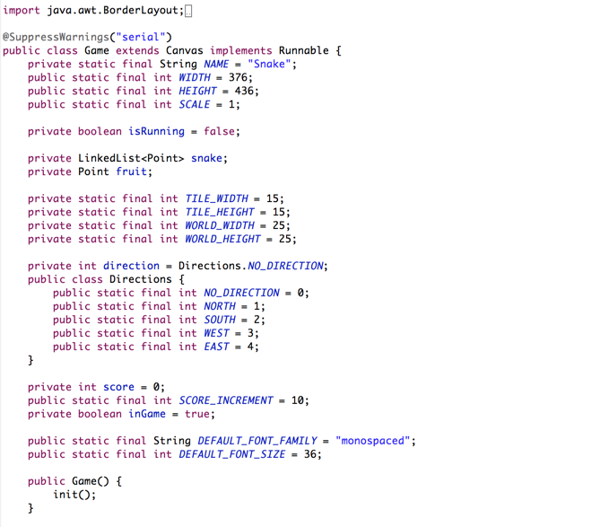

# Snake [Java]

## About

Snake is a game where the player maneuvers a line which grows in length, with the line itself being a primary obstacle. There is no standard version of the game. The concept originated in the 1976 arcade game Blockade, and its simplicity has led to many implementations (some of which have the word snake or worm in the title). After a variant was preloaded on Nokia mobile phones in 1998, there was a resurgence of interest in the Snake concept as it found a larger audience.

The player controls a dot, square, or object on a bordered plane. As it moves forward, it leaves a trail behind, resembling a moving snake. In some games, the end of the trail is in a fixed position, so the snake continually gets longer as it moves. In another common scheme, the snake has a specific length, so there is a moving tail a fixed number of units away from the head. The player loses when the snake runs into the screen border, a trail, or another obstacle.

## Install

In order to start playing this game, you will need to clone/download it to your machine.
